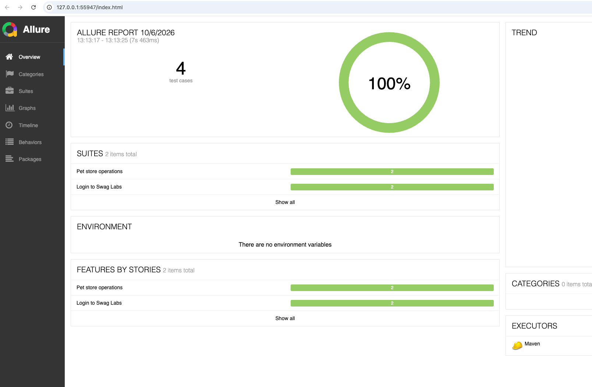
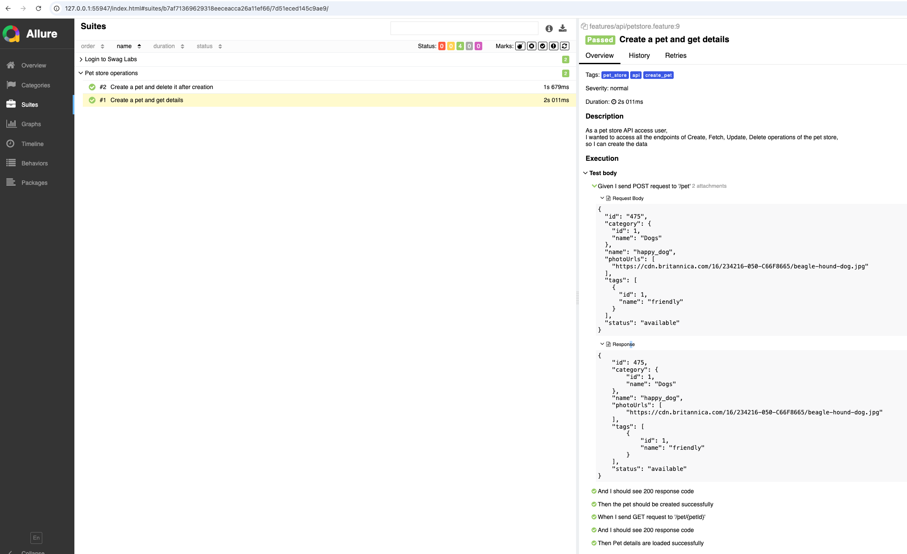
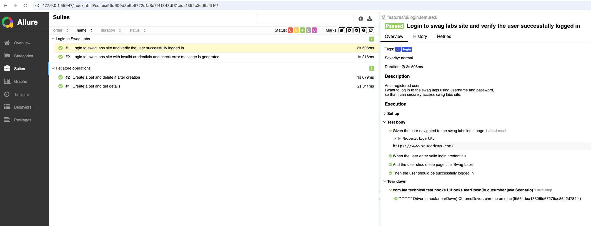

## Overview
This repository contains a Java/Maven automation framework built to validate both UI and API layers. The framework follows industry-standard BDD (Behaviour-Driven Development) practices using Cucumber and Gherkin, with a Page Object Model (POM) design for maintainable and reusable UI automation.
- API automation leverages Rest Assured with reusable request templates and JSONPath validations.
- UI automation is powered by Selenium WebDriver, following a Page Object Model structure for maintainability.
- Reporting is handled by Allure, providing interactive dashboards and detailed execution insights.
- The framework supports API and UI test automation within the same project, enabling end-to-end validation across different application layers.

## Technology used
- Java, Maven, Selenium WebDriver, Cucumber, Gherkin, POM, Rest Assured, JUnit, Hamcrest, Allure, Git

## Prerequisites
- Preferred code editor (IntelliJ IDEA)
- Java 11+ 
- Maven
- Allure for reporting
- For Windows - Must be downloaded and configured properly in the environment variables
- For MacOS - Must be downloaded using homebrew or any other suitable

## Getting Started

### Clone the repo
git clone <repo-url>

### Install dependencies
mvn clean install

## Running Tests

### Running All Tests
**mvn clean test**

### Running API Tests
**mvn clean test "-Dcucumber.filter.tags=@api"**

### Running UI Tests
**mvn clean test "-Dbrowser=chrome-headless" "-Dcucumber.filter.tags=@ui"**

## Viewing Reports
To view reports locally: After running the tests run the below command 
**mvn allure:serve**
(This will start a local server and open the interactive Allure dashboard in your browser.)

(I've attached screenshots from Allure report)

